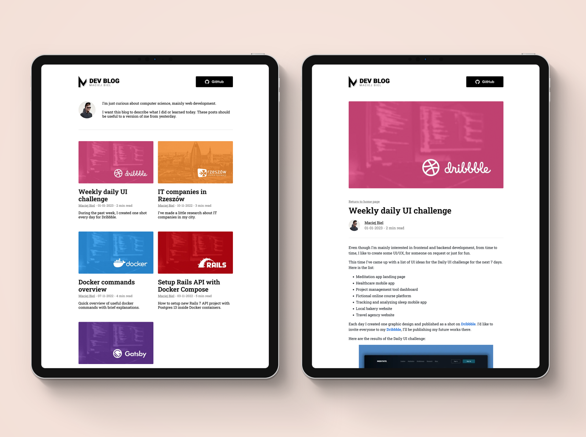

# Simple Blog Project

## Description

This project is a simple blog built using HTML and CSS. It includes a homepage displaying a list of blog posts and individual blog post pages. The design features a clean and modern layout with images and styled typography.

## Design Preview

### Homepage Layout




## Features

- Homepage with a list of blog posts
- Individual blog post pages
- Responsive design
- Custom typography and styling

## Installation

To set up the blog locally, follow these steps:

1. **Clone the Repository:**
    ```bash
    git clone https://github.com/Diyaa-Gubarah/personal-portfolio.git
    ```

2. **Navigate to the Project Directory:**
    ```bash
    cd personal-portfolio
    ```

3. **Open the `index.html` File in Your Browser:**
    Simply open the `index.html` file using your preferred web browser to view the homepage.
    
4. **Open Individual Blog Posts:**
    Open any of the `blog1.html`, `blog2.html`, `blog3.html`, `blog4.html`, or `blog5.html` files to view individual blog posts.

## File Structure

The project includes the following files and directories:

- `index.html` - The homepage listing all blog posts.
- `blog1.html` - Individual blog post page (replace with other blog post files as needed).
- `css/` - Directory containing CSS files (`home.css` for the homepage, `post.css` for blog posts).
- `assets/` - Directory containing image assets for the blog.

## Usage

1. **Homepage:**
    - View the list of blog posts.
    - Click on "Read more" links to navigate to individual blog posts.

2. **Blog Post Pages:**
    - Read the full content of each blog post.
    - Use the "Return Home" link to go back to the homepage.


